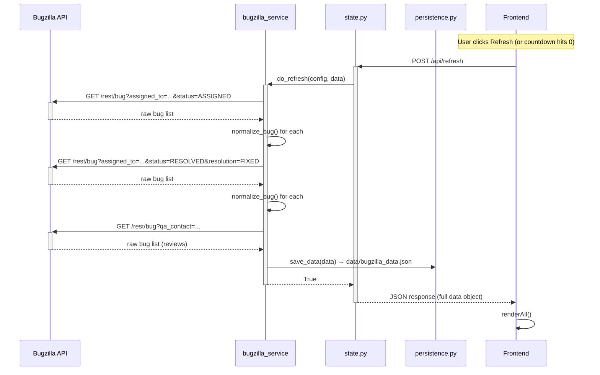
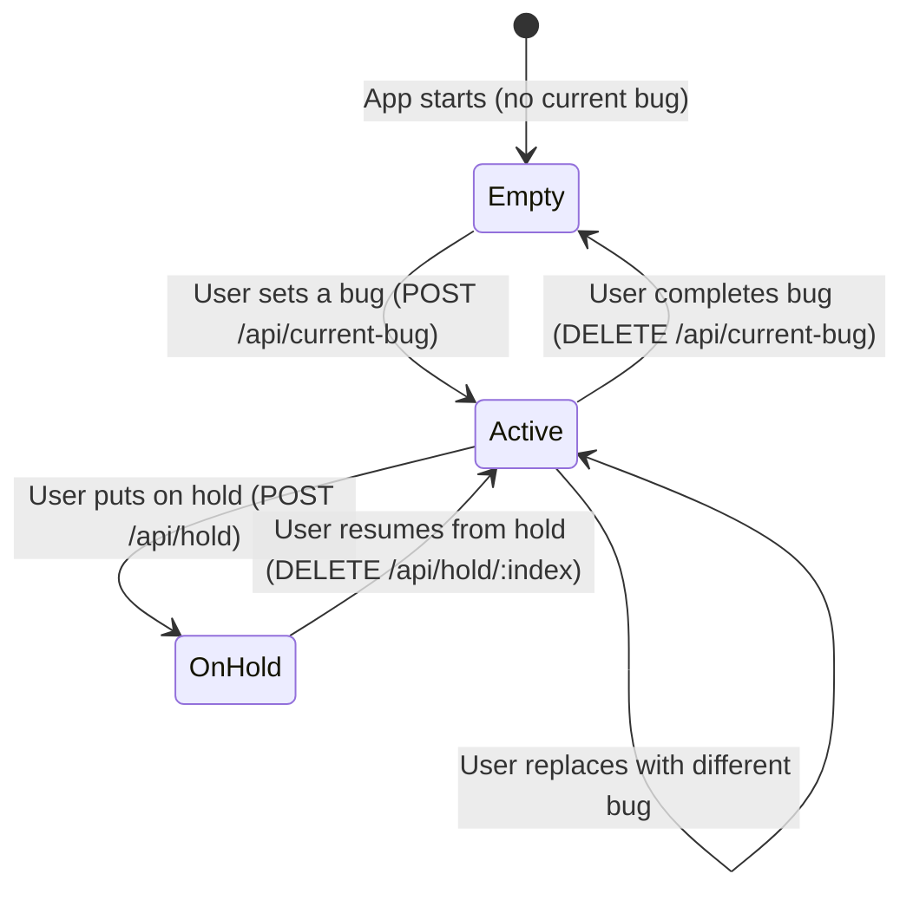

# Data Flow

## Bug Data Lifecycle



## API Request Lifecycle

```
Frontend                    Flask Route                 Service Layer
--------                    -----------                 -------------
api('POST', '/api/refresh')
    → HTTP POST             refresh() [routes/data.py]
                            acquire lock
                            → do_refresh()              bugzilla_service.do_refresh()
                                                        → create_client()
                                                        → fetch_bugs() × 5 queries
                                                        → normalize_bug() for each
                                                        → save_data()
                            release lock
                            ← jsonify(data)
    ← parsed JSON
    → renderAll()
```

## Current Bug State Transitions



## Local Priority Flow

```
To Work tab render
    ↓
getLocalSubPrios()          ← reads localStorage
    ↓
autoAssignSubPrios()        ← assigns ranks to unranked bugs
normaliseSubPrios()         ← compacts 1..N
    ↓
sort bugs by subPrioSortVal()
    ↓
render table with ▲/▼ buttons
    ↓
User clicks ▲ or drags row
    ↓
moveSubPrio() or drag handler
    ↓
setLocalSubPrio()           → writes localStorage
    ↓
renderBugTable()            ← re-render with new order
```

## Persistence Model

| File | Purpose | Written by | Read by |
|------|---------|-----------|---------|
| `data/bugzilla_config.json` | API credentials, URL, view settings | `save_config()` | `load_config()` |
| `data/bugzilla_data.json` | All bug lists, current bug, hold list | `save_data()` | `load_data()` |
| `logs/bugmail.log` | Application log entries | Python `logging` | `/api/logs` endpoint |
| `localStorage` (browser) | Sub-priorities, commit state, branches | Frontend JS | Frontend JS |
