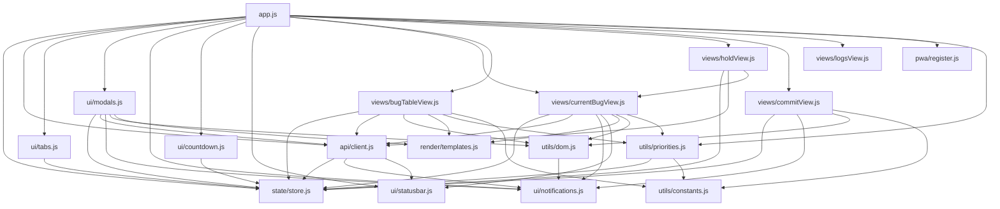

# Frontend Architecture

## Directory Structure

```
webapp/
├── index.html              HTML layout only (~200 lines, zero inline JS)
├── style.css               Complete design system (CSS custom properties)
├── manifest.json           PWA manifest
├── sw.js                   Service worker (cache-first for shell)
├── icons/
│   ├── icon-192.png
│   └── icon-512.png
└── js/
    ├── app.js              Bootstrap, renderAll(), event wiring, init sequence
    ├── api/
    │   └── client.js       HTTP fetch wrapper, refresh/stop/wipe actions
    ├── state/
    │   └── store.js        Centralized state object (single source of truth)
    ├── ui/
    │   ├── tabs.js         Main tab + sub-tab switching
    │   ├── modals.js       Settings modal, bug-picker modal
    │   ├── notifications.js Toast notification system
    │   ├── countdown.js    60-second auto-refresh countdown
    │   └── statusbar.js    Status dot + text management
    ├── views/
    │   ├── currentBugView.js  Current bug card, set/complete/hold actions
    │   ├── bugTableView.js    Bug table, sorting, drag-drop, column toggles
    │   ├── holdView.js        On-hold bugs list
    │   ├── commitView.js      Commit prompt system (~320 lines)
    │   └── logsView.js        Server log viewer
    ├── render/
    │   └── templates.js    Badge CSS classes, shared HTML helpers
    ├── utils/
    │   ├── constants.js    Column definitions, tab keys, localStorage keys
    │   ├── dom.js          HTML escaping, clipboard, rich text copy helpers
    │   └── priorities.js   Local sub-priority system (localStorage-backed)
    └── pwa/
        └── register.js     Service worker registration
```

## Module Dependency Graph



## Rendering Pipeline

```
Data Change (refresh / user action)
    ↓
renderAll()  [app.js]
    ├── purgeNonAssignedPrios()     remove stale priority entries
    ├── autoAssignSubPrios()        assign ranks to new bugs
    ├── normaliseSubPrios()         compact ranks to 1..N
    ├── renderCurrentBug()          current bug card
    ├── renderHoldList()            on-hold list
    ├── renderBugTable()            main bug table
    └── renderCounts()              sub-tab badge counts
```

## State Management

### Application State (`state/store.js`)
Single mutable object shared across all modules:
- `data` — bug data from backend (mirrors `bugzilla_data.json`)
- `config` — configuration from backend
- `activeTab` — current sub-tab key
- `sortCol` / `sortDir` — table sort state
- `countdown` — seconds until next refresh
- `visibleCols` — column visibility toggles
- `colWidths` — saved widths for table columns

### Local State (`localStorage`)
Persistent user preferences not synced to backend:
- `bz_local_sub_prio` — per-bug priority ranking (To Work tab)
- `bz_sort_col` / `bz_sort_dir` — table sort state
- `bz_col_widths` — customized column widths for the bug table
- `bz_commit_state` — commit prompt form values
- `bz_branches_*` — branch lists per repository
- `bz_repos` — repository list
- `bz_file_hist` — file path autocomplete history

## Event Architecture

All event wiring happens in two places:
1. **`app.js` init** — wires header buttons, modal inits, tab inits
2. **`_wireFormEvents()` in views** — wires dynamically-generated HTML via `data-*` attributes and `addEventListener`

No inline `onclick` handlers exist in the HTML. Dynamic content uses `data-*` attributes that are wired after each render.

## PWA

- **Service Worker** (`sw.js`): Cache-first for shell assets, network-only for `/api/*`
- **Manifest** (`manifest.json`): Standalone display mode, purple theme
- **Icons**: 192px and 512px PNG variants
