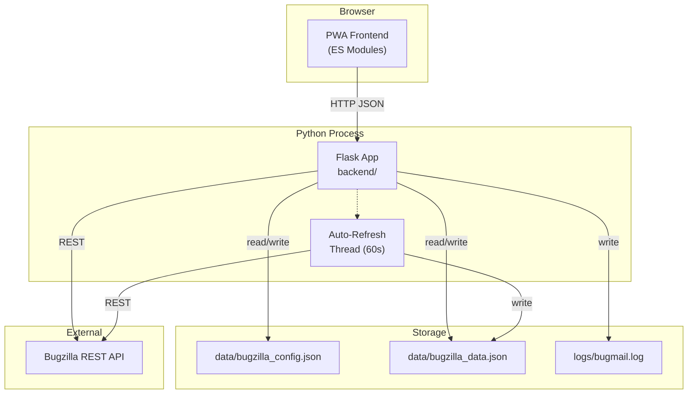

# System Overview

Bugzilla Tracker is a lightweight, self-hosted personal bug tracker that wraps the Bugzilla REST API with a Flask backend and a vanilla JavaScript PWA frontend.

## Architecture

## Runtime Flow

1. **Startup** (`python server.py`)
   - Binds sentinel socket on port 5001 (single-instance guard)
   - Creates Flask app via `backend.create_app()`
   - Starts auto-refresh daemon thread
   - Opens browser to `http://localhost:5000`
   - Runs Flask on port 5000

2. **Frontend Init** (`js/app.js`)
   - Loads config from `/api/config`
   - Loads cached bug data from `/api/data`
   - Renders all views
   - Starts 60-second countdown timer
   - Auto-refreshes if API key is configured

3. **Refresh Cycle**
   - Countdown reaches 0 → frontend POSTs `/api/refresh`
   - Backend calls Bugzilla API via `apiBugzilla.py`
   - Normalised data saved to `data/bugzilla_data.json`
   - Response sent to frontend → views re-render
   - Background thread also refreshes every 60s independently

4. **Single-Instance Guard**
   - Port 5001 sentinel socket prevents duplicate servers
   - If a second instance launches, it sends a restart request to the first

## Technology Stack

| Layer | Technology |
|-------|-----------|
| Backend | Python 3.14, Flask |
| Frontend | Vanilla JavaScript (ES Modules) |
| Styling | Vanilla CSS with custom properties |
| API Client | `apiBugzilla.py` (custom Bugzilla REST wrapper) |
| Persistence | JSON files on disk |
| PWA | Service worker + manifest.json |
| Deployment | Windows Task Scheduler + VBScript launcher |

## Key Design Decisions

- **No frameworks** (React, Vue, etc.) — keeps the stack simple, fast, zero build step
- **ES Modules** — native browser support, explicit imports, tree-shakeable
- **JSON persistence** — no database needed for a single-user tool
- **Thread-safe state** — global `_state` dict protected by `threading.Lock`
- **Blueprint routes** — clean separation of API concerns
